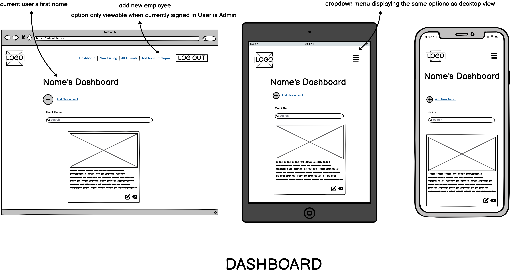
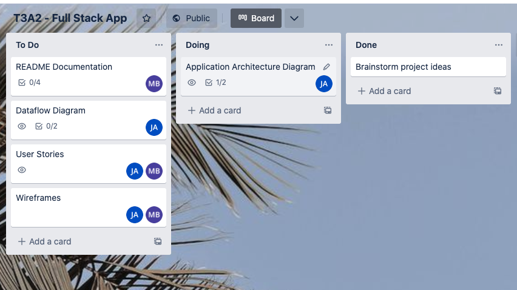
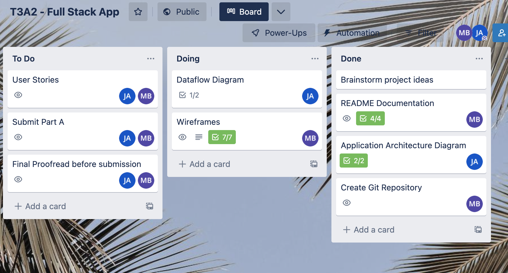
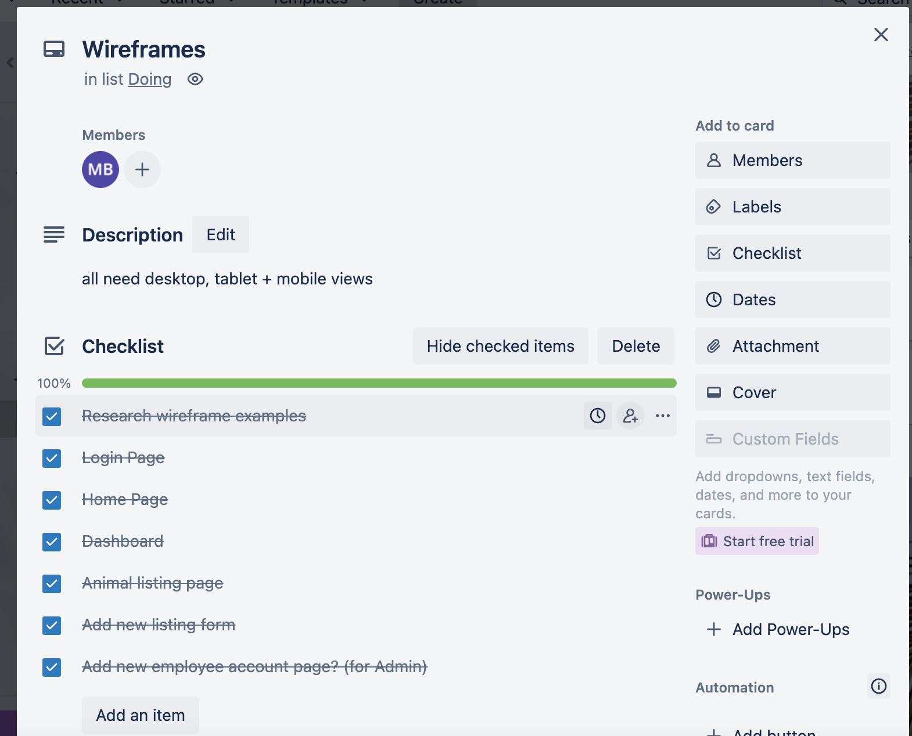
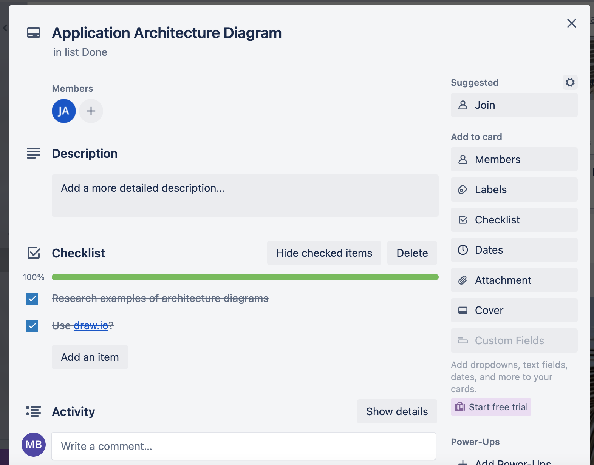
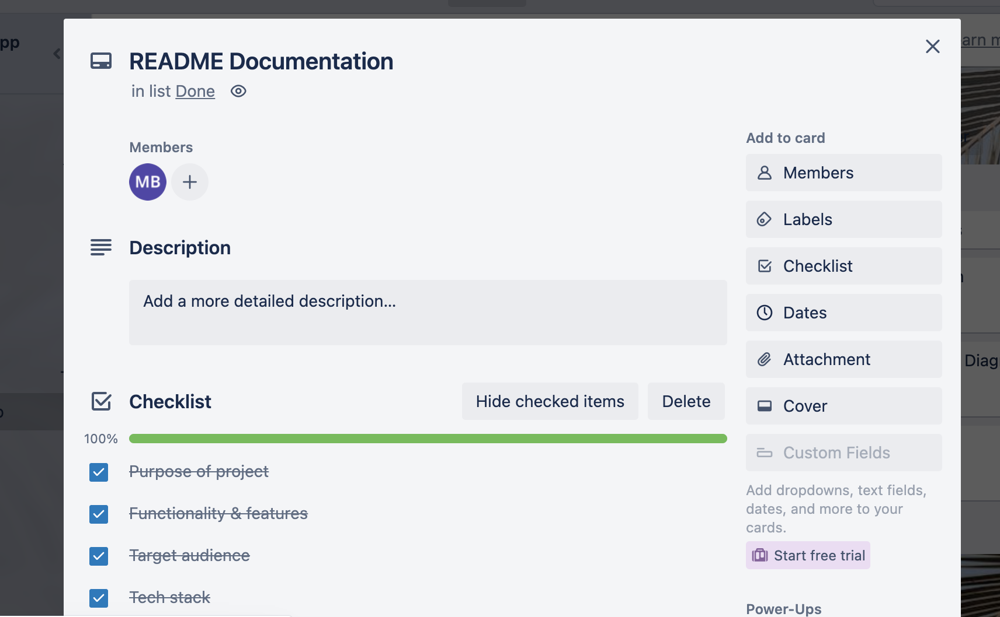
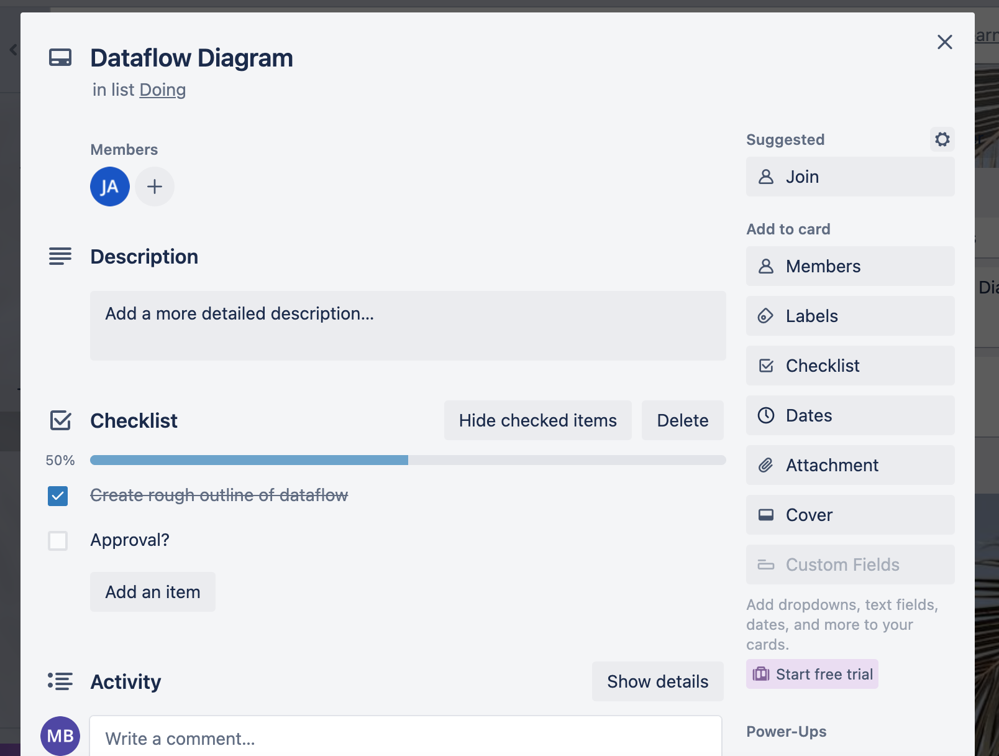

## T3A2 Part A

-------
### Description
##### Purpose
Our website, PetMatch, is a web-based internal system designed to assist animal shelters/pet adoption agencies in managing their animal listings. The main purpose of the website is to provide a centralised location for storing and updating information about the animals' who are available for adoption at the shelter, or in current vet care at the shelter. 

This information can include basic details such as the animal's name, age, breed, and a photo, as well as more specific information in each listing description that is relevant for other staff at the shelter to know such as notes about medication or compatibility with other pets. By having this information in one place, employees can easily access and update it. This will help streamline the adoption process and improve not only the communication between staff at the shelter, but also the overall care of the animals and the accuracy of information provided to customers who are looking to adopt a pet.

##### Functionality/ features
- Employee login and Dashboard: Employees will be able to access the system using a login which is unique to each individual employee, which will ensure that only authorised staff have access to the information. It will also assist in internal communication as employees will be able to view which of their colleagues created a listing.
- Admin Login and Dashboard: The application will have different levels of access to ensure maximum security and data integrity. Regular employee accounts will be able to read and update all of their current animal listings, as well as delete and create new listings as necessary. The admin login will have all of these capabilities in addition to being able to add new user accounts for new employees. This will significantly increase the security of the site, as it prevents unwanted accounts from being created by people who are unauthorised, as creating a new account can only be done with the Admin login details. As all employee accounts will have the capability to edit all the shelters listings and view the shelters private information, this feature is one of the key requirements of the client.
- Animal Listings: The website will have a list of animals available for adoption, which will include basic information such as the animal's name, age, type (for example dog, cat, bird etc), and a photo of the animal. Each listing will also have a description field where employees can also add notes about the animal's medical history, behaviour, and compatibility with other pets, as well as any other information that may be useful for other employees who handle the animals at the shelter as well as potential adopters.
- Full CRUD functionality: Employees will have the ability to create new animal listings, read existing information, update existing information, and delete listings of animals that no longer need to be stored in their system.
- Adoption Tracking: The website will allow employees to update an animal's listing from available to adopted when an animal is adopted. This will make it easy for employees to track which animals are still available for adoption and which have been adopted, allowing them to quickly provide accurate information to customers who wish to adopt a pet as well as streamline their internal processes.

##### Target audience
Target Audience: The target audience for the website is local animal shelters and pet adoption agencies. It is intended for internal use by employees to manage information about the animals within their care and improve internal communication. It is not intended for public use.

##### Tech stack
- Front-end: React.js is used to handle the client-side logic of the application, which we have used to create reusable UI components that send and retrieve data from the back-end. HTML5, CSS and JavaScript are all used to create responsive UI views.
- Back-end: Express.js and Node.js are used to handle the server-side logic of the website.
- Database: MongoDB is used to store information about both employee login information and the animals and their listings.
- Testing: Postman, Jest
- Project Management: Discord, Trello
- Source control: Git, GitHub
- Deployment: Railway, Netlify

### Dataflow Diagram

### Application Architecture Diagram

### User Stories

### Wireframes
Our wireframes represent three standard screen sizes: Desktop, Tablet and Mobile.

Due to the application being an internal system, the opening screen will be the log in. This ensures all users are authorized as employees before being able to access any of the information stored about the animals within the application.

The individual animal listings will be accessible on their own page, which will be routed based on the listing id.

As specified, the new employee form will only be accessible when the currently signed in user is an Admin, as per the user requirements.

### Trello board screenshots

